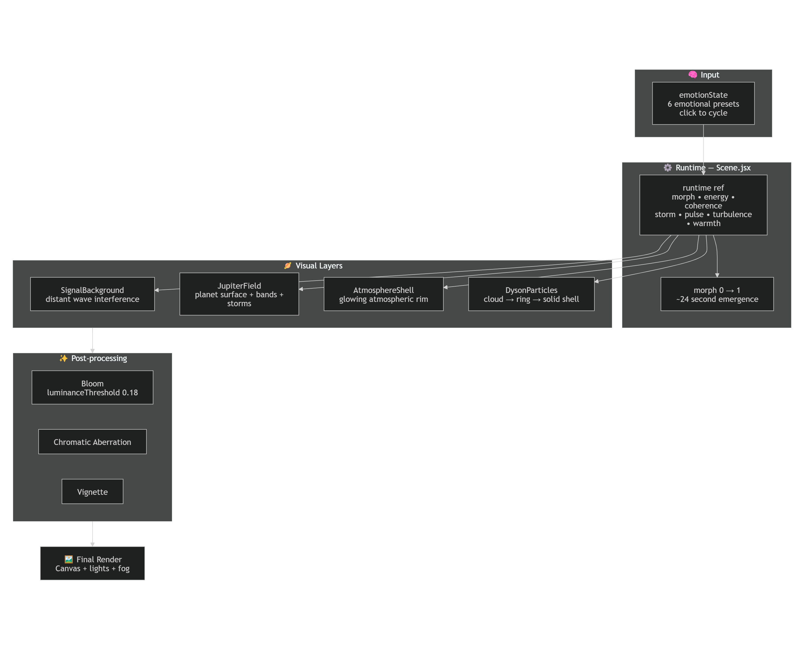

# echoJupiter

> **Signal emerging from noise through interference, modulation, and time.**

echoJupiter is a real-time interactive 3D shader system built with **React**, **Vite**, and **React Three Fiber**. It visualizes emotional states as a living, morphing planetary system — where abstract signal interference gradually coalesces into a turbulent gas giant surrounded by a dynamic Dyson-like particle shell.

The project treats the screen as a **dynamic signal field** that evolves over time, driven by layered wave interference, emotion-modulated uniforms, and a slow morph from chaos into coherent planetary structure.

> **Photosensitivity Warning**  
> This project contains flashing lights, pulsing neon effects, bloom, high-contrast animations, and rapid visual changes that may trigger photosensitivity or discomfort.

---

## Overview

echoJupiter explores **visual emergence** — how structure, rhythm, and color can arise from layered interference and emotional modulation.

Core ideas:
- **Interference** through overlapping procedural waves
- **Emotion-driven modulation** via runtime shader uniforms
- **Temporal emergence** through a slow morph from abstract field to planetary body
- **Pulse & turbulence** as expressive visual energy

---

## Features

- Real-time **GLSL** shader rendering with multi-wave vertex displacement
- **6 emotion states** (Dormant → Awakening → Coherent → Ecstatic → Volatile → Oracle) that control turbulence, pulse, warmth, coherence, storm intensity, and particle behavior
- **Time-based morph transition** (~24s) from abstract signal interference to fully formed Jupiter-like planet
- Layered 3D scene:
  - `JupiterField` — procedural gas giant with bands and storm displacement
  - `AtmosphereShell` — glowing back-side atmospheric rim with fresnel + pulse
  - `DysonParticles` — 2600 particles that dynamically morph from random cloud → equatorial ring → solid spherical shell based on coherence
  - `SignalBackground` — distant interference field that fades as the planet emerges
- Post-processing stack: **Bloom** + **Chromatic Aberration** + **Vignette**
- Emotion-controlled color shifting (abstract neon ↔ warm Jupiter bands + storms)
- Clean component architecture with shared runtime state

---

## Tech Stack

| Technology                    | Role                                      |
|-------------------------------|-------------------------------------------|
| **React 19**                  | UI & state management                     |
| **Vite**                      | Fast dev server + HMR                     |
| **Three.js**                  | 3D rendering engine                       |
| **@react-three/fiber**        | React renderer for Three.js               |
| **@react-three/postprocessing** | EffectComposer, Bloom, post effects     |
| **GLSL Shaders**              | Real-time procedural visuals              |

---

## Getting Started

```bash
npm install
npm run dev

### Open in browser
Vite will provide a local development URL, usually:

```
Open http://localhost:5173/
Click anywhere on the canvas to cycle through emotion states.
```

---

## Project Structure

echoJupiter/
├── src/
│   ├── App.jsx                 # Emotion state + Canvas wrapper
│   ├── scene.jsx               # Main orchestrator + runtime state + postprocessing
│   ├── JupiterField.jsx        # Planet surface shader
│   ├── AtmosphereShell.jsx     # Glowing atmosphere shader
│   ├── DysonParticles.jsx      # Dynamic particle shell system
│   ├── SignalBackground.jsx    # Distant interference field
│   ├── emotionStates.js        # 6 emotion parameter presets
│   ├── App.css
│   ├── index.css
│   └── main.jsx
├── public/
├── package.json
└── README.md
```

---

##  Architecture

echoJupiter is structured as a **layered real-time visual system**:

### Input Layer
- emotion state (React `useState`)

### Runtime Layer
- React + React Three Fiber render loop

### Scene Layer
```
Canvas
└── Field
    └── Mesh
        ├── Plane Geometry
        └── Shader Material
```

### Shader Layer

**Vertex Shader**
- wave generation
- multi-wave interference
- geometry displacement

**Fragment Shader**
- intensity calculation
- color modulation
- neon pulse behavior

### Output Layer
- Component,Description,Emotion Influence
JupiterField,Main planetary mesh with multi-wave displacement and banded gas giant coloring,"turbulence, storm, warmth, morph"
AtmosphereShell,Larger back-side sphere with fresnel rim glow and pulsing waves,"coherence, pulse, warmth, morph"
DysonParticles,2600 instanced points that morph between formations based on coherence,"coherence, emotion, particleEvolve"
SignalBackground,Distant interference plane that fades during morph,"emotion, morph, pulse, energy"

---

##  Architectural Flow



---

##  Current State

The current build includes:

- a real-time shader field  
- multi-wave interference in the vertex shader  
- emotion-driven modulation through shader uniforms  
- neon pulse behavior in the fragment shader  

---

##  Conceptual Direction

echoJupiter treats the screen as a **dynamic field** rather than a static surface.

Instead of simply rendering motion, the system explores how:

- **interference** creates structure  
- **modulation** alters perception  
- **time** introduces pulse and rhythm  
- **state** becomes visible through color and intensity  

---

##  Roadmap

Possible next steps include:

- ✨ particle background layer  
- 📡 radial signal propagation  
- 💥 collapse / convergence behavior  
- 🎛️ expanded state controls  
- 🎨 additional visual encoding experiments  

---

## Author

**Built by ZachBach**

