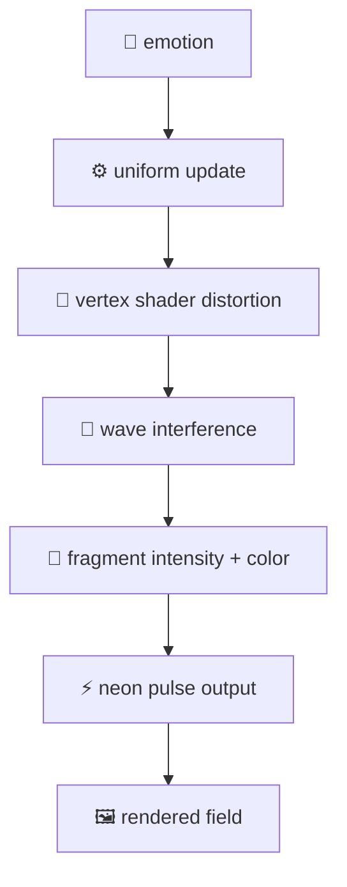

# echoJupiter

> **Signal emerging from noise through interference, modulation, and time.**

A real-time interactive shader system exploring how structure emerges from interference, modulation, and time.  
Built with **React**, **Vite**, and **React Three Fiber**, it turns abstract input into a living visual field of motion, intensity, and neon pulse.

---

##  Overview

echoJupiter is an interactive visual system built around the idea of **signal emerging from noise**.

The project uses layered wave interference, animated shader distortion, and color modulation to create a living field that responds to input over time.

At its core, echoJupiter explores:

-  **Interference** through overlapping wave functions  
-  **Emotion-driven modulation** through runtime-controlled shader uniforms  
-  **Signal emergence** through motion, intensity, and color  
-  **Pulse behavior** using time-based neon energy effects

---

##  Features

- Real-time **GLSL** shader rendering  
- Multi-wave interference in the vertex shader  
- Emotion-controlled visual modulation  
- Neon pulse overlay in the fragment shader  
- React + Vite development workflow  
- Built with **React Three Fiber** on top of Three.js  

---

##  Tech Stack

| Technology              | Role                          |
|-------------------------|-------------------------------|
| **React**               | UI & state management         |
| **Vite**                | Lightning-fast dev server     |
| **Three.js**            | 3D rendering foundation       |
| **@react-three/fiber**  | React renderer for Three.js   |
| **GLSL Shaders**        | Real-time visual computation  |

---

##  Getting Started

### 1. Install dependencies
```bash
npm install
```

### 2. Start the development server
```bash
npm run dev
```

### 3. Open in browser
Vite will provide a local development URL, usually:

```
http://localhost:5173/
```

---

##  Project Structure

```text
echoJupiter/
├── src/
│   ├── App.jsx
│   └── main.jsx
├── public/
├── package.json
└── README.md
```

---

##  Architecture

echoJupiter is structured as a **layered real-time visual system**:

### Input Layer
- emotion state (React `useState`)

### Runtime Layer
- React + React Three Fiber render loop

### Scene Layer
```
Canvas
└── Field
    └── Mesh
        ├── Plane Geometry
        └── Shader Material
```

### Shader Layer

**Vertex Shader**
- wave generation
- multi-wave interference
- geometry displacement

**Fragment Shader**
- intensity calculation
- color modulation
- neon pulse behavior

### Output Layer
- animated visual field rendered in real time

---

##  Architectural Flow



---

##  Current State

The current build includes:

- a real-time shader field  
- multi-wave interference in the vertex shader  
- emotion-driven modulation through shader uniforms  
- neon pulse behavior in the fragment shader  

---

##  Conceptual Direction

echoJupiter treats the screen as a **dynamic field** rather than a static surface.

Instead of simply rendering motion, the system explores how:

- **interference** creates structure  
- **modulation** alters perception  
- **time** introduces pulse and rhythm  
- **state** becomes visible through color and intensity  

---

##  Roadmap

Possible next steps include:

- ✨ particle background layer  
- 📡 radial signal propagation  
- 💥 collapse / convergence behavior  
- 🎛️ expanded state controls  
- 🎨 additional visual encoding experiments  

---

## Author

**Built by ZachBach**

